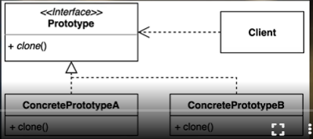

기존 인스턴스를 프로토타입으로 사용해서(복제해) 새로운 인스턴스를 만든다
시간이 오래걸리는 작업
* 데이터베이스에서 조회해서 인스턴스를 생성하는 경우
* 네트워크를 거쳐서 http 요청을 보내서 가저온 데이터를 기반으로 인스턴스를 생성하는 경우
매번 db,http를 거쳐서 접근한다면 그 인스턴스를 만들때마다 시간이 오래걸리고 리소스를 많이 쓴다

https://refactoring.guru/ko/design-patterns/prototype

* clone 메서드를 갖고 있는 인터페이스를 만들고 구현해야한다
* 장점
  * 복잡한 객체를 만드는 과정을 숨길 수 있다
  * 기존 객체를 복제하는 과정이 새 인스턴스를 만드는 것보다 비용면에서 효율적일 수 있다
  * 추상적인 타입을 리턴할 수 있다.
* 단점
  * 복제한 객체를 만드는 과정 자체가 복잡할 수 있다.
    (특히,순혼 참조가 있는 경우

직렬화?
